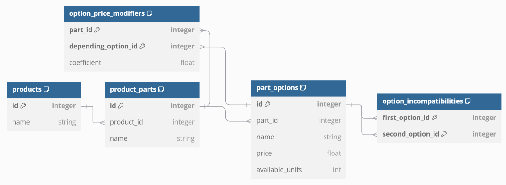
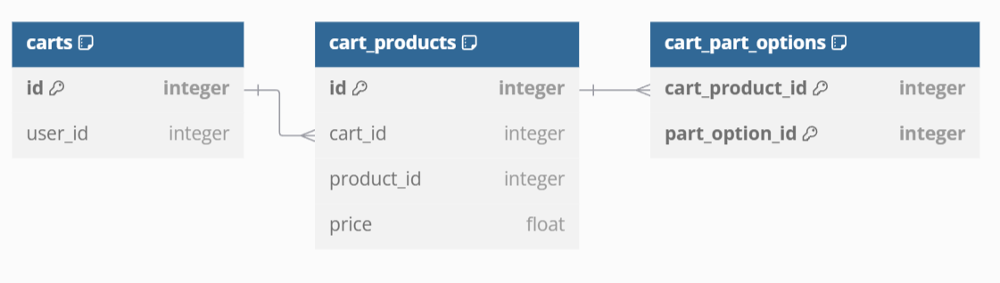

# Marcus Sports Equipment Store

[](https://github.com/JaviCervera/bicycle-shop/actions/workflows/test.yml)

## Instructions

The application requires Python 3.11 and PIP. It is recommended to use a
virtual environment before doing any of the following. To install one on
a Unix-like system (like Linux, macOS or WSL) using `venv`, open a terminal
and run the following:

```shell
python3 -m venv venv
source venv/bin/activate
```

The application dependencies can be installed with:

```shell
pip install -r requirements.txt
```

However, if you want to run the tests and linters locally (they are set up as a
CI job on GitHub Actions that run automatically on every commit pushed), you
can instead run:

```shell
pip install -r requirements-dev.txt
```

The application has a simple terminal based interface to test the
functionality. It can be run in one of two modes:

* As a monolith, with frontend and backend deployed as a single application.
* With a split frontend / backend architecture.

To run the application as a monolith, just run:

```shell
python3 main.py
```

To run with a split backend / frontend architecture, first start the server by running:

```shell
python3 server.py
```

And then, on a separate terminal session, do:

```shell
python3 main.py --url http://localhost:8080
```

## Problem description

You're tasked with building a website that allows Marcus, a bicycle shop owner, to sell his bicycles.

Marcus owns a growing business and now wants to sell online. He also tells you that bicycles are his main product, but if the business continues to grow, he will surely start selling other sports-related items such as skis, surfboards, roller skates, etc. It would be a nice bonus if the same website allowed him to sell those things as well [1].

What makes Marcus's business successful is that customers can fully customize their bicycles. They can select many different options for the various parts of the bicycle [2]. Here is an incomplete list of all the parts and their possible choices, to give an example:

* Frame type: Full-suspension, diamond, step-through
* Frame finish: Matte, shiny
* Wheels: Road wheels, mountain wheels, fat bike wheels
* Rim color: Red, black, blue
* Chain: Single-speed chain, 8-speed chain

On top of that, Marcus points out that some combinations are prohibited because they are not possible in reality [3]. For example:

* If you select "mountain wheels," then the only frame available is the full-suspension.
* If you select "fat bike wheels," then the red rim color is unavailable because the manufacturer doesn't provide it.

Additionally, Marcus sometimes doesn't have all possible variations of each part in stock, so he wants to be able to mark them as "temporarily out of stock" to avoid receiving orders he can't fulfill [4].

Finally, Marcus explains how to calculate the price that you should present to the customer after customizing a bicycle. Normally, this price is calculated by adding up the individual prices of each selected part [5]. For example:

* Full suspension = 130 EUR
* Shiny frame = 30 EUR
* Road wheels = 80 EUR
* Rim color blue = 20 EUR
* Chain: Single-speed chain = 43 EUR
* Total price: 130 + 30 + 80 + 20 + 43 = 303 EUR

However, the price of some options might depend on others. For instance, the frame finish is applied over the whole bicycle, so the more area to cover, the more expensive it gets. Because of that, the matte finish over a full-suspension frame costs 50 EUR, while applied over a diamond frame it costs 35 EUR [6].

These kinds of variations can always happen, and they might depend on any of the other choices, so Marcus asks you to consider this, as otherwise, he would be losing money.

## Requirements

1. The store must be able to sell different kinds of products.
2. Each product is divided in different parts that the client can customize by choosing from several options for each part.
3. The option selected for a part might be incompatible with other options of any parts.
4. You can't select options which are out of stock.
5. The price of a product is calculated by adding up the individual prices of each selected part.
6. The price of the options in some parts might depend on which options were selected for other parts.

## System architecture

With the requirements given, the application must support the use cases to
select elements from a catalog of parts for bicycles, and no features like
purchasing is requested to be implemented, so it has been left out.

The implementation follows an OOP design with emphasis on SOLID principles
and a separation of responsibilities following
[*Domain Driven Design*](https://en.wikipedia.org/wiki/Domain-driven_design).

The application uses a simplified
[Clean Architecture](https://blog.cleancoder.com/uncle-bob/2012/08/13/the-clean-architecture.html)
with 3 layers:

> Infrastructure -> Application -> Domain

The arrows represent the direction in which dependencies can be defined. For
example, `Infrastructure` can know about components defined in `Application`
or `Domain`, but none of those can know about the `Infrastructure` layer.

* `Domain` resides in the package `catalog.domain` and defines the classes that
  map the concepts specified in the requirements and their business logic.
  The classes here mostly enforce some invariants on the data (following the
  [*Design by contract*](https://en.wikipedia.org/wiki/Design_by_contract)
  approach). The classes implemented in this layer are immutable.
  Also in this layer are defined the interfaces for the repositories used to
  retrieve and store the domain models in the database. As persistence is a
  concern of the `Infrastructure` layer, they are just interfaces in this
  layer, and the actual implementation will be injected by the infrastructure
  into the use cases that require them (this complies with the
  [*Dependency inversion principle*](https://en.wikipedia.org/wiki/Dependency_inversion_principle)).
* `Application` is implemented in the package `catalog.application`, and defines
  the use cases that have been extracted from the requirements. Coordination
  of the classes in the `Domain` layer, persistence through the repositories,
  and logging are the responsibilities assigned to this layer. The use cases
  are the following:
  * List available products.
  * List part types for a given product.
  * List options available for a part type based on other options selected
    for other parts.
  * Return the total price of all options specified, taking into account
    that some of them can influence the price of others.
* `Infrastructure` layer can be found in the package `catalog.infrastructure`.
  For this task, an infrastructure based on an in memory **SQLite** database has
  been used. An implementation for all repositories defined in the `Domain`
  layer has been written, which access the SQLite database.
  [`SQLAlchemy`](https://www.sqlalchemy.org/)'s ORM facilities have been used
  to implement this, so switching to a different database like **MySQL** can
  be done easily just by modifying the connection information in SQLAlchemy.
  Functions to initialize the repositories with sample data matching the one
  given on the exercise description are provided, and used both in the 
  integration tests for the repositories and the backend.
  
  Also, [`Marshmallow`](https://marshmallow.readthedocs.io/en/stable/)'s
  schemas for the domain classes are provided in this package to aid with
  the serialization and deserialization of the data for use in the server's
  responses.

On the monolithic mode, the CLI app directly calls into a `Catalog` instance
which represents all the use cases for the proposed bicycle store task. On the
split mode, the CLI app calls into a `CatalogProxy` instance which forwards the
calls through a REST API to the server. The interface of both classes is
identical, and they act as a [*Facade*](https://en.wikipedia.org/wiki/Facade_pattern).

The component who uses the Facade should not access anything defined on the
other side (so a Facade keeps the components on each side of itself completely
decoupled from each other). This means that the classes defined on the other
end should not be accessible outside the Facade. However, to keep this solution
lightweight, the domain classes are directly imported from `catalog.domain` as
a shortcut and to avoid duplication of classes in such a small piece of code.

## Requirements conformance

1. The store must be able to sell different kinds of products.

> This requirement is satisfied by providing a `ProductsAction` class that can
> return an arbitrary number of `Product`s.

2. Each product is divided in different parts that the client can customize by choosing from several options for each part.

> `ProductPartsAction` returns the list of `ProductPart`s available for a
> specific product. `PartOptionsAction` returns the options available
> for a given part.

3. The option selected for a part might be incompatible with other options of any parts.

> `PartOptionRepository` can provide a list of `PartOption`s which are incompatible
> with the given one. `PartOptionsAction` returns the options available for a
> part based on other options selected.

4. You can't select options which are out of stock.

> `PartOption` has an `in_stock` property that indicates this. This property
> returns `True` when the `available_units` of the option is greater than 0.
> `PartOptionsAction` returns only options which are in stock.

5. The price of a product is calculated by adding up the individual prices of each selected part.

> `PartOptionsPriceAction` computes the total price from a list of parts.

6. The price of the options in some parts might depend on which options were selected for other parts.

> `PartOptionsPriceAction` takes into account if a selected option modifies
> other options in the list.

## Data model

Specified in [DBML](https://dbml.dbdiagram.io/home) using [dbdiagram.io](https://dbdiagram.io).



```
Table products {
  id integer [primary key]
  name string
  note: 'The list of products in the catalog'
}

Table product_parts {
  id integer [primary key]
  product_id integer
  name string
  note: 'The parts that conform each product'
}

Table part_options {
  id integer [primary key]
  part_id integer
  name string
  price float
  available_units int
  note: 'The available options for each part, with price and availability'
}

Table option_incompatibilities {
  first_option_id integer [primary key]
  second_option_id integer [primary key]
  note: 'Indicates incompatibility between two options'
}

Table option_price_modifiers {
  part_id integer [primary key]
  depending_option_id integer [primary key]
  coefficient float
  note: 'Indicates that the price of all options in a part will be affected by a given coefficient if an option is selected'
}

Ref: product_parts.product_id > products.id
Ref: part_options.part_id > product_parts.id
Ref: option_incompatibilities.first_option_id > part_options.id
Ref: option_incompatibilities.second_option_id > part_options.id
Ref: option_price_modifiers.part_id > product_parts.id
Ref: option_price_modifiers.depending_option_id > part_options.id
```

## User Actions (OpenAPI specification)

Not all endpoints specified here have been implemented in the provided code, as
some of these endpoints refer to tasks which were not required in the
specification but mentioned in some parts of this documentation.

```yaml
openapi: 3.0.3
info:
  title: Marcus Sports Equipment Store
  version: 1.0.0
paths:
  /catalog/products:
    get:
      summary: Retrieves a list of available products in the catalog
      responses:
        '200':
          description: Successful operation
          content:
            application/json:
              schema:
                type: array
                items:
                  $ref: '#/components/schemas/Product'
    post:
      summary: Create a new product
      requestBody:
        description: Create a new product
        content:
          application/json:
            schema:
              $ref: '#/components/schemas/ProductNew'
      responses:
        '200':
          description: Successful operation
          content:
            application/json:
              schema:
                $ref: '#/components/schemas/Product'
        '400':
          description: Invalid input
    put:
      summary: Update a product
      requestBody:
        description: Update a product
        content:
          application/json:
            schema:
              $ref: '#/components/schemas/Product'
      responses:
        '204':
          description: Successful operation
        '400':
          description: Invalid product id
  /catalog/products/{product_id}:
    delete:
      summary: Delete a product
      parameters:
        - name: product_id
          in: path
          description: Id of the product
          required: True
          schema:
            type: integer
            format: int32
      responses:
        '204':
          description: Successful operation
        '400':
          description: Invalid product id
  /catalog/product_parts:
    get:
      summary: Get all parts available for the given product
      parameters:
        - name: product
          in: query
          description: Id of the product 
          required: true
          schema:
            type: integer
            format: int32
      responses:
        '200':
          description: Successful operation
          content:
            application/json:
              schema:
                type: array
                items:
                  $ref: '#/components/schemas/ProductPart'
    post:
      summary: Create a new product part
      requestBody:
        description: Create a new product part
        content:
          application/json:
            schema:
              $ref: '#/components/schemas/ProductPartNew'
      responses:
        '200':
          description: Successful operation
          content:
            application/json:
              schema:
                $ref: '#/components/schemas/ProductPart'
        '400':
          description: Invalid input
    put:
      summary: Update a product part
      requestBody:
        description: Update a product part
        content:
          application/json:
            schema:
              $ref: '#/components/schemas/ProductPart'
      responses:
        '204':
          description: Successful operation
        '400':
          description: Invalid product part id
  /catalog/product_parts/{product_part_id}:
    delete:
      summary: Delete a product part
      parameters:
        - name: product_part_id
          in: path
          description: Id of the product part
          required: True
          schema:
            type: integer
            format: int32
      responses:
        '204':
          description: Successful operation
        '400':
          description: Invalid product part id
  /catalog/part_options:
    get:
      summary: Get all options available for a part which are compatible with the already selected options
      parameters:
        - name: product_part
          in: query
          description: Id of the part 
          required: true
          schema:
            type: integer
            format: int32
        - name: selected_options
          in: query
          description: Ids of the selected options (for any part) 
          required: true
          schema:
            type: array
            items:
              type: integer
              format: int32
      responses:
        '200':
          description: Successful operation
          content:
            application/json:
              schema:
                type: array
                items:
                  $ref: '#/components/schemas/PartOption'
    post:
      summary: Create a new part option
      requestBody:
        description: Create a new part option
        content:
          application/json:
            schema:
              $ref: '#/components/schemas/PartOptionNew'
      responses:
        '200':
          description: Successful operation
          content:
            application/json:
              schema:
                $ref: '#/components/schemas/PartOption'
        '400':
          description: Invalid input
    put:
      summary: Update a part option
      requestBody:
        description: Update a part option
        content:
          application/json:
            schema:
              $ref: '#/components/schemas/PartOption'
      responses:
        '204':
          description: Successful operation
        '400':
          description: Invalid part option id
  /catalog/part_options/{part_option_id}:
    delete:
      summary: Delete a part option
      parameters:
        - name: part_option_id
          in: path
          description: Id of the part option
          required: True
          schema:
            type: integer
            format: int32
      responses:
        '204':
          description: Successful operation
        '400':
          description: Invalid part option id
  /catalog/part_options_price:
    get:
      summary: Get the total price of all options selected
      parameters:
        - name: selected_options
          in: query
          description: Ids of the selected options (for any part) 
          required: true
          schema:
            type: array
            items:
              type: integer
              format: int32
      responses:
        '200':
          description: Successful operation
          content:
            application/json:
              schema:
                $ref: '#/components/schemas/Price'
  /catalog/part_option_incompatibilities:
    post:
      summary: Create a new incompatibility
      requestBody:
        description: Create a new incompatibility
        content:
          application/json:
            schema:
              $ref: '#/components/schemas/PartOptionIncompatibility'
      responses:
        '204':
          description: Successful operation
        '400':
          description: Invalid input
    delete:
      summary: Delete an incompatibility
      parameters:
        - name: first_option_id
          in: query
          description: Id of the first option
          required: true
          schema:
            type: integer
            format: int32
        - name: second_option_id
          in: query
          description: Id of the second option
          required: true
          schema:
            type: integer
            format: int32
      responses:
        '204':
          description: Successful operation
        '400':
          description: Invalid input
  /catalog/price_modifiers:
    post:
      summary: Create a new price modifier
      requestBody:
        description: Create a new price modifier
        content:
          application/json:
            schema:
              $ref: '#/components/schemas/OptionPriceModifier'
      responses:
        '204':
          description: Successful operation
        '400':
          description: Invalid input
    put:
      summary: Update a price modifier (only coefficient can change)
      requestBody:
        description: Create a new price modifier
        content:
          application/json:
            schema:
              $ref: '#/components/schemas/OptionPriceModifier'
      responses:
        '204':
          description: Successful operation
        '400':
          description: Invalid input
    delete:
      summary: Delete a price modifier
      parameters:
        - name: part_id
          in: query
          description: Id of the product 
          required: true
          schema:
            type: integer
            format: int32
        - name: depending_option_id
          in: query
          description: Id of the depending option 
          required: true
          schema:
            type: integer
            format: int32
      responses:
        '204':
          description: Successful operation
        '400':
          description: Invalid input
components:
  schemas:
    ProductNew:
      type: object
      required:
        - name
      properties:
        name:
          type: string
          example: Bicycles
    Product:
      allOf:
        - $ref: '#/components/schemas/ProductNew'
        - type: object
          required:
            - id
          properties:
            id:
              type: integer
              format: int32
              example: 1
    ProductPartNew:
      type: object
      required:
        - product_id
        - name
      properties:
        product_id:
          type: integer
          format: int32
          example: 1
        name:
          type: string
          example: Frame type
    ProductPart:
      allOf:
        - $ref: '#/components/schemas/ProductPartNew'
        - type: object
          required:
            - id
          properties:
            id:
              type: integer
              format: int32
              example: 1
    PartOptionNew:
      type: object
      required:
        - part_id
        - name
        - price
        - available_units
      properties:
        part_id:
          type: integer
          format: int32
          example: 1
        name:
          type: string
          example: Full-suspension
        price:
          type: number
          format: float
          example: 130.0
        available_units:
          type: integer
          format: int32
          example: 5
    PartOption:
      allOf:
        - $ref: '#/components/schemas/PartOptionNew'
        - type: object
          required:
            - id
          properties:
            id:
              type: integer
              format: int32
              example: 1
    Price:
      type: object
      required:
        - price
      properties:
        price:
          type: number
          format: float
          example: 120.25
    PartOptionIncompatibility:
      type: object
      required:
        - first_option_id
        - second_option_id
      properties:
        first_option_id:
          type: integer
          format: int32
          example: 1
        second_option_id:
          type: integer
          format: int32
          example: 2
    OptionPriceModifier:
      type: object
      required:
        - part_id
        - depending_option_id
        - coefficient
      properties:
        part_id:
          type: integer
          format: int32
          example: 1
        depending_option_id:
          type: integer
          format: int32
          example: 2
        coefficient:
          type: number
          format: float
          example: 0.7
```

## Product page


The initial version of the store will only offer bicycles, but the application
is prepared to offer more types of products, so a dropdown on the top left
could offer a choice of products. On page load, a request to
`/catalog/products` would be made to fill this dropdown. Each product could
display an image on the page, for which we would have to update the
`products` DB table and their associated domain model with an additional
field for the image URL.

When a product is selected, `/catalog/product_parts` would be called
to retrieve the list of parts for the product. Once retrieved, each part
type would be represented with a label on the UI, while a call to
`/catalog/part_options` would be used for each part to retrieve the available
options, to be display on a dropdown below each label.

Selection an option on any of the categories would require to request the
options available for each part to be retrieved again, as the availability of
options can depend on which others are selected, so changing the option for one
part might be enabling new options on others.

Every time an option is selected, a call to `/catalog/part_options_price` would
be performed to retrieve the final price of the product with the selected
options. Close to the place where the price is displayed, an "Add to cart"
button should appear.

## Adding to the cart

When the user clicks on the button, the system needs to store the information
about the part options selected, so when the user comes back to the page, the
product still appears on their shopping cart until it is discarded or
purchased.

The first thing to highlight is that all the functionality that has been
discussed until now belonged in a
[*bounded context*](https://en.wikipedia.org/wiki/Domain-driven_design#Relationship_to_other_ideas)
that we named `catalog`. Introducing a shopping cart could introduce
a second `cart` context, which would be deployed as a second microservice if
that was the kind of infrastructure selected.

The database model for this second context would be:



```
Table carts {
  id integer [primary key]
  user_id integer
  note: 'The shopping cart for a given user'
}

Table cart_products {
  id integer [primary key]
  cart_id integer
  product_id integer
  price float
  note: 'A product added to a specific shopping cart'
}

Table cart_part_options {
  cart_product_id integer [primary key]
  part_option_id integer [primary key]
  note: 'An option selected for a part for a product in a shopping cart'
}

Ref: cart_products.cart_id > carts.id
Ref: cart_part_options.cart_product_id > cart_products.id
```

There's a few things to note here:

First, the cart holds a `user_id`. This is a 1:1 relationship, so each user on
the store would have their own shopping cart. This implies that a `users` table
would need to exists, but I have left the `user` bounded context outside of
the scope.

Second, the price that the final product had at the time it was added to the
cart is preserved in `cart_product`. This could give the UI the chance to
highlight options who have seen their price reduced since they were added, as
that could persuade the user to purchase the product.

## Administrative workflows

### New product creation


The UI could present a text field at the top to introduce the name of the new
product. Below, the screen would be split vertically in two parts:

* On the left, another text field with a "+" button next to it allows to
  introduce the parts available for the product. Underneath, there would be
  a list view with all the parts, with buttons to edit or remove parts.
* On the right, the same layout would be presented, but this side allows to
  define part options for the part selected on the left.

At the bottom, there should be buttons to cancel the creation of the product,
or to confirm it. Cancelling would simply close the screen without any effect
on the database. Creating the product, however would require the following
endpoints:

* `/catalog/products (POST)`: Receives the product name on the body, and
  creates it by inserting a new row in the `products` table, generating an
  autoincremented id automatically. The created product is returned.
* `/catalog/product_parts (POST)`: Receives the product id and the part name on
  the body, and creates the part by inserting a new row in the `product_parts`
  table, generating an autoincremented id automatically. The created product
  part is returned.
* `/catalog/part_options (POST)`: Receives the product part id, the name, the
  price, and the number of available units on the body, and creates the option
  by inserting a new row in the `part_options` table, generating an
  autoincremented id automatically. The created part option is returned.

If any of the endpoints fail, the process should abort and any endpoints
successfully called would have to be rolled back by invoking a `DELETE` verb
on them (probably using the [*Saga* pattern](https://en.wikipedia.org/wiki/Long-running_transaction)).

### Adding a new part choice

The previous section already displays a page that lets you define a new product
with its parts and option. It would just be a matter of allowing it to support
editing existing products. For that, we could see a page with the list of
products available, and when selecting one we could go to the product creation
page, but the button to create a product would be replaced with "Update
product".

When the button is pressed, the action executed is considerably different from
the one for the creation of a product. It would do the following:

* If the name of the product has changed, a `PUT` request to
  `/catalog/products` will update it.
* The list of parts will be compared with the old list:
  * Newly added items will be created with a `POST` to `/catalog/product_parts`.
  * Removed items will be deleted with a `DELETE` to the endpoint.
* The list of options will be compared with the old list:
  * New added items will be created with a `POST` to `/catalog/part_options`.
  * Removed items will be deleted with a `DELETE` to the endpoint.
  * Ones who have had the price or availability modified will send a `PUT` to
    the endpoint.

### Setting incompatibilities between parts

There should be an "Option incompatibilities" page in the user admin section
like this:


This screen could let you select a pair of part options that should be
incompatible between them.

A list on the left side of the screen could let you select any of the available
options. The list of the right let you select between all the other options for
the same product that do not belong to the same part.

When the selection is confirmed by clicking the button on the bottom right, the
selection should be compared against what was already registered on the database.

Any new incompatibility pair should be registered with a `POST` call to
`/catalog/part_option_incompatibilities`. Any removed pair should be deleted
with `DELETE`.

I has to be noted that this is a reciprocal relationship, so an incompatibility
between options `1` and `2` is the same as an incompatibility between `2` and
`1`. The endpoint will always register the option with the lower id as
`first_option_id`. The UI should make sure that no incompatibilities are
defined twice, for example by now showing on the other list an incompatible
option that has already been defined for the other option selected.

### Setting prices

For changing the price of a defined option, it would follow the same process
stated for **"Adding a new part choice"**. For indicating how to define options
that modify the price of other options, the following solution was designed
to satisfy the requirements:

An option can alter the price of all options in a different part by applying a
coefficient for it. For example, all options in the part "Frame finish" will
see their price affected by a coefficient of 0.7 if the option "Diamond" (for
the part "Frame type") is selected.

In the previous example, the price of the different frame finishes depend on
the area of the frame type where it will be applied. The price of the frame
finishes could be provided on price per square meter, and then each type of
frame could specify their area as the coefficient for the price of the
finishes.

For setting up these price modifiers, the following UI could be presented to
the user:


After the user makes their selection by adding, removing, or updating price
modifiers, the `/catalog/price_modifiers` endpoint could be used:

* `POST` request to add new modifiers.
* `PUT` request to update existing modifiers.
* `DELETE` request to delete modifiers.

The operations requires the `part_id` whose options' price will be modified,
the `option_id` that must be selected in order to use the price modifier, and
the `coefficient` of the modifier. The deletion of a modifier only requires the
first two, as they are set as the primary keys in the database.
